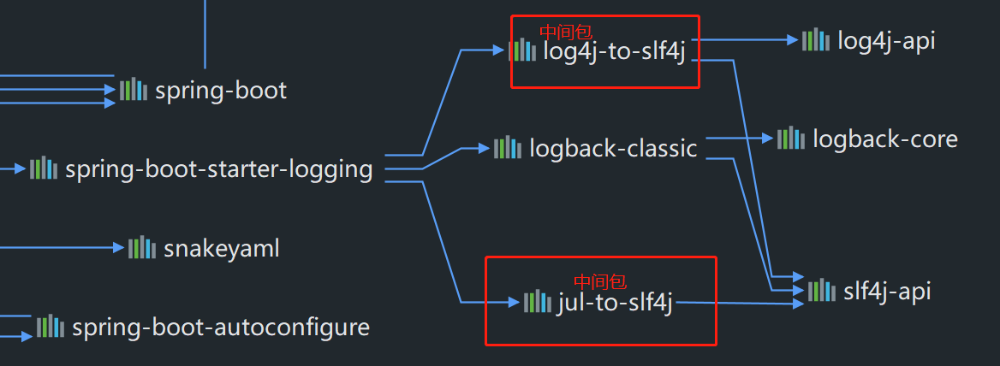
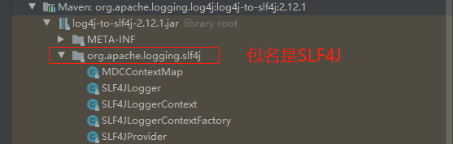

### 日志框架

#### 1、市面上的一些日志框架

- JUL（java.util.logging）
- JCL（Jakarta Commons Logging）
- Jboss-logging
- logback
- log4j
- log4j2
- slf4j（Simple Logging Facade for Java）

#### 2、日志框架的组合

| 日志门面（日志的抽象）    | 日志实现                    |
| ------------------------- | --------------------------- |
| JCL、Jboss-logging、slf4j | JUL、log4j、log4j2、logback |

**日志框架的选择就是从左边选一个门面，右边选择一个实现，怎么选？**

- 日志门面：JCL最后一次更新是2014年，Jboss-logging太少人用，一般选择slf4j。

- 日志实现：log4j、logback、slf4j都是出自同一个人之手，适配性肯定最好；logback是log4j的升级版；log4j2是apache的，据说太过强大；JUL是后面才有的，用的也不多，因此一般选择logback。

**Springboot底层是Spring框架，Spring默认使用JCL，但是Springboot选用的是SLF4J和Logback。**

#### 3、SLF4J的使用

##### 1. 如何在系统中使用SLF4J

实际开发过程中，日志记录方法的调用，不应该直接调用日志框架的实现类，而是调用日志抽象层里面的方法。

```java
import org.slf4j.Logger;
import org.slf4j.LoggerFactory;

public class HelloWorld {
  public static void main(String[] args) {
    Logger logger = LoggerFactory.getLogger(HelloWorld.class);
    logger.info("Hello World");
  }
}
```

2. ##### SLF4J与其他日志实现的组合使用方式图示：


**每一个日志实现框架都有自己的配置文件，使用SLF4J，配置文件还是要使用对应日志实现的配置文件。**

#### 3、遗留问题

假设一个应用的不同框架使用了不同的日志实现，比如，A（SLF4J + Logback）、B（commons-logging）、C（Jboss-logging），能不能统一日志实现呢？


**一句话，就是使用偷天换日、偷梁换柱、狸猫换太子包。**

让应用中所有日志都统一为SLF4J步骤：

1. 先将其他日志框架排除。
2. 用中间包代替原来的日志框架。
3. 导入SLF4J其他的实现。

#### 4、SprinBoot底层





**SpringBoot能够自动识别所有的日志框架，底层使用SLF4J + Logback记录日志，在引入其他框架的时候，只需要把这个框架依赖的日志排除掉就可以了。**