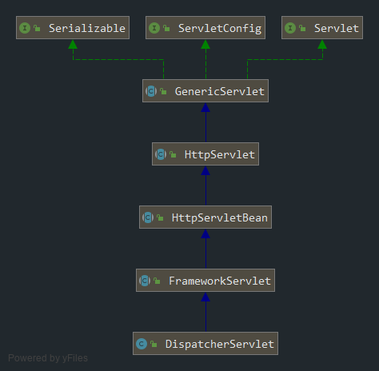

### 一、请求的函数调用流程：

```java
HttpServlet.service(ServletRequest req, ServletResponse res)    
->    HttpServlet.service(HttpServletRequest req, HttpServletResponse resp)    
->    FrameworkServlet.doGet(HttpServletRequest req, HttpServletResponse resp)
->	  FrameworkServlet.processRequest(HttpServletRequest request, HttpServletResponse response)    
->    DispatcherServlet.doService(HttpServletRequest request, HttpServletResponse response)    
->    DispatcherServlet.doDispatch(HttpServletRequest request, HttpServletResponse response)
```

------

### 二、相关类层次关系：



### 三、doDispatch流程：

```java
	/**
	 * Process the actual dispatching to the handler.
	 * <p>The handler will be obtained by applying the servlet's HandlerMappings in order.
	 * The HandlerAdapter will be obtained by querying the servlet's installed HandlerAdapters
	 * to find the first that supports the handler class.
	 * <p>All HTTP methods are handled by this method. It's up to HandlerAdapters or handlers
	 * themselves to decide which methods are acceptable.
	 * @param request current HTTP request
	 * @param response current HTTP response
	 * @throws Exception in case of any kind of processing failure
	 */
    protected void doDispatch(HttpServletRequest request, HttpServletResponse response) throws Exception {
        HttpServletRequest processedRequest = request;
        HandlerExecutionChain mappedHandler = null;
        boolean multipartRequestParsed = false;
        WebAsyncManager asyncManager = WebAsyncUtils.getAsyncManager(request);

        try {
            ModelAndView mv = null;
            Exception dispatchException = null;

            try {
                // 1、检查多部件，即检查是否是文件上传请求
                processedRequest = checkMultipart(request);
                multipartRequestParsed = (processedRequest != request);

                // Determine handler for the current request.
                // 2、根据当前请求地址，找到哪个Controller能处理请求，返回目标处理器的执行链（HandlerExecutionChain）
                mappedHandler = getHandler(processedRequest);

                // 3、如果没有找到处理器能处理这个请求，就抛异常或报404
                if (mappedHandler == null) {
                    noHandlerFound(processedRequest, response);
                    return;
                }

                // Determine handler adapter for the current request.
                // 4、拿到能执行这个类的所有方法的适配器（相当于反射工具：RequestMappingHandlerAdapter）
                HandlerAdapter ha = getHandlerAdapter(mappedHandler.getHandler());

                // Process last-modified header, if supported by the handler.
                String method = request.getMethod();
                boolean isGet = "GET".equals(method);
                if (isGet || "HEAD".equals(method)) {
                    long lastModified = ha.getLastModified(request, mappedHandler.getHandler());
                    if (new ServletWebRequest(request, response).checkNotModified(lastModified) && isGet) {
                        return;
                    }
                }

                if (!mappedHandler.applyPreHandle(processedRequest, response)) {
                    return;
                }

                // Actually invoke the handler.
                // 处理（控制）器的方法被调用；处理器（Handler）、控制器（Controller）
                // 5、适配器来执行目标方法：将目标方法执行后的返回值作为视图名，设置保存到ModelAndView中
                // 无论目标方法怎么写，最终适配器执行完成后将执行后的信息封装成ModelAndView
                mv = ha.handle(processedRequest, response, mappedHandler.getHandler());

                if (asyncManager.isConcurrentHandlingStarted()) {
                    return;
                }
                // 如果没有视图名，则设置一个默认的视图名，如返回值为void
                applyDefaultViewName(processedRequest, mv);
                mappedHandler.applyPostHandle(processedRequest, response, mv);
            }
            catch (Exception ex) {
                dispatchException = ex;
            }
            catch (Throwable err) {
                // As of 4.3, we're processing Errors thrown from handler methods as well,
                // making them available for @ExceptionHandler methods and other scenarios.
                dispatchException = new NestedServletException("Handler dispatch failed", err);
            }
            // 转发到目标页面
            // 6、根据上面封装的ModelAndView，转发到对应页面，并且ModelAndView中的数据可以从请求域中获取
            processDispatchResult(processedRequest, response, mappedHandler, mv, dispatchException);
        }
        catch (Exception ex) {
            triggerAfterCompletion(processedRequest, response, mappedHandler, ex);
        }
        catch (Throwable err) {
            triggerAfterCompletion(processedRequest, response, mappedHandler,
                    new NestedServletException("Handler processing failed", err));
        }
        finally {
            if (asyncManager.isConcurrentHandlingStarted()) {
                // Instead of postHandle and afterCompletion
                if (mappedHandler != null) {
                    mappedHandler.applyAfterConcurrentHandlingStarted(processedRequest, response);
                }
            }
            else {
                // Clean up any resources used by a multipart request.
                if (multipartRequestParsed) {
                    cleanupMultipart(processedRequest);
                }
            }
        }
    }
```

### 四、doDispatch小结：

1. getHandler()：根据当前请求地址找到能够处理这个请求的目标处理器（Controller）：根据当前请求地址在HandlerMapping中找到能够处理这个请求的目标处理器（Controller）；
2. getHandlerAdapter()：根据当前处理器类找到能够执行这个处理器类方法的适配器（HandlerAdapter）；
3. 使用刚才找到的适配器（RequestMappingHandlerAdapter）执行目标方法；
4. 目标方法执行后返回一个ModelAndView对象；
5. 根据ModelAndView的信息转发到对应页面，并且可以从请求域中获取到ModelAndView中保存的数据。