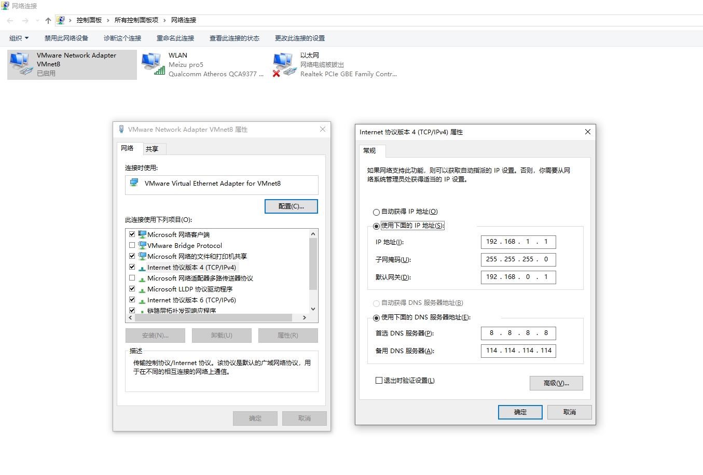
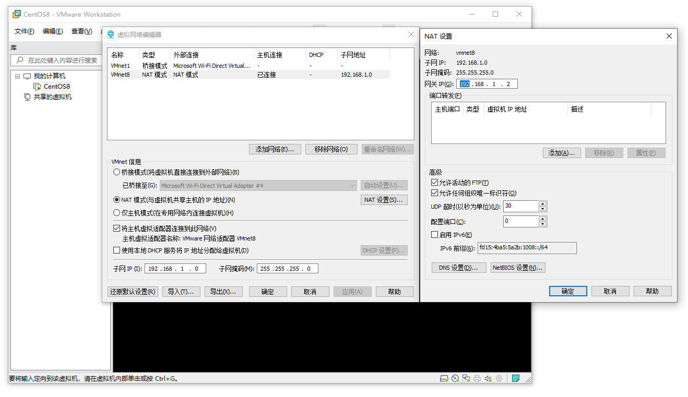
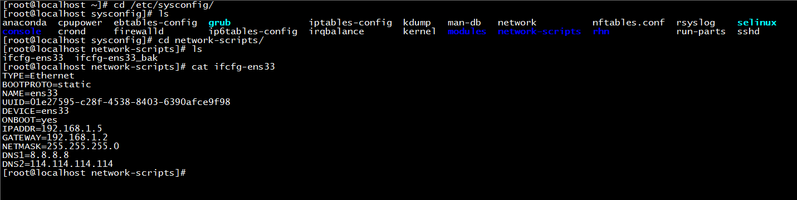
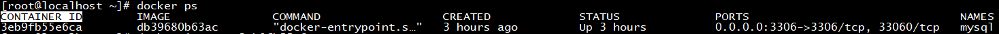
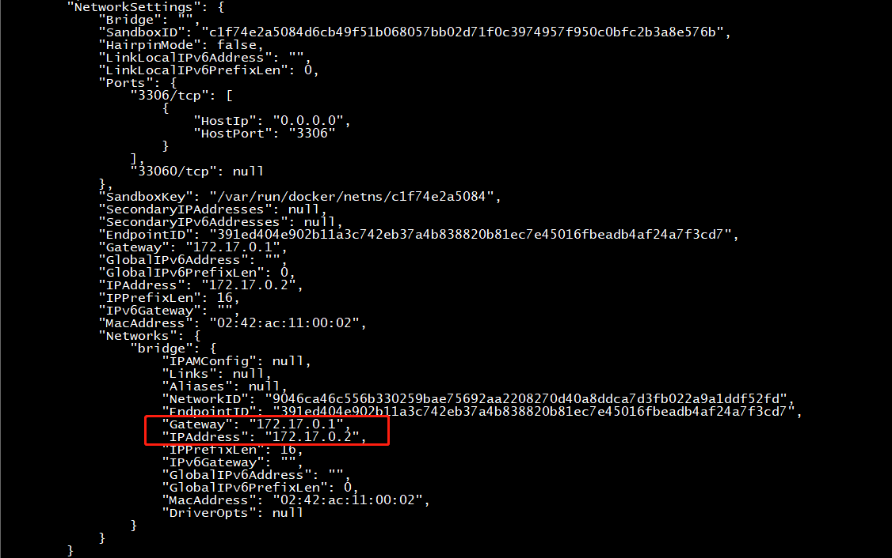
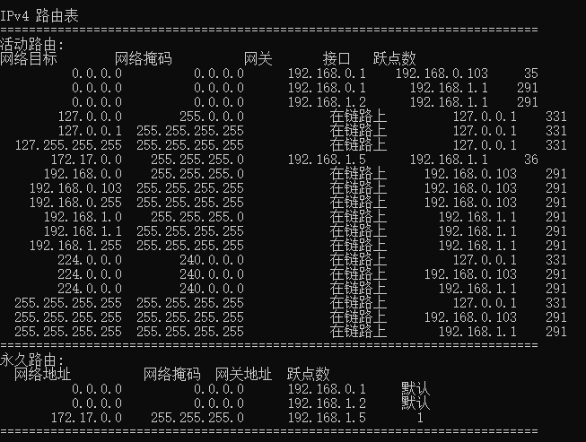
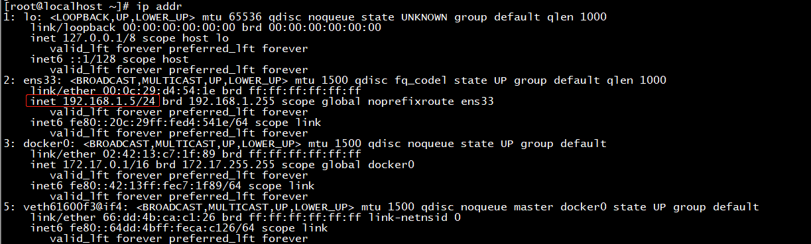
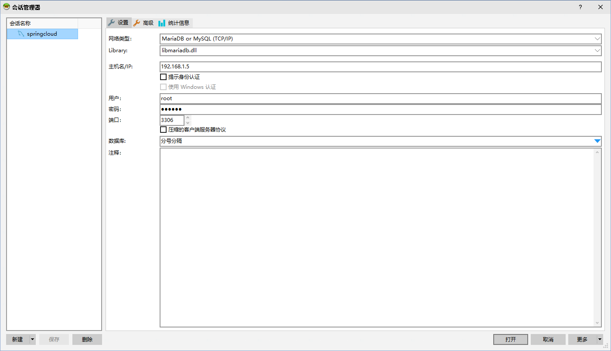

### Win10使用HeidiSQL链接虚拟机CentOS8里面的MySQL

#### 1. 前提

**宿主机与虚拟机能相互通信，虚拟机关闭防火墙。**

适配器VMnet8配置：



虚拟机与宿主机的网络链接模式（NAT）：


Centos8的网络配置文件：




### 2. 配置

1. 查看在docker中mysql运行的ip：
```bash
docker ps	// 先查看CONTAINER ID
docker inspect 3eb9fb55e6ca // 查看IP
```
 
----


2. 在win10中添加路由映射信息：

以管理员身份执行：

```
route add -p 172.17.0.0 mask 255.255.255.0 192.168.1.5
route print -4
```



192.168.1.5是虚拟机的IP：



#### 3. 使用HeidiSQL连接MYSQL

mysql启动命令：

```
docker run -d --name mysql -p 3306:3306 -e MYSQL_ROOT_PASSWORD=123456 db39680b63ac
```
